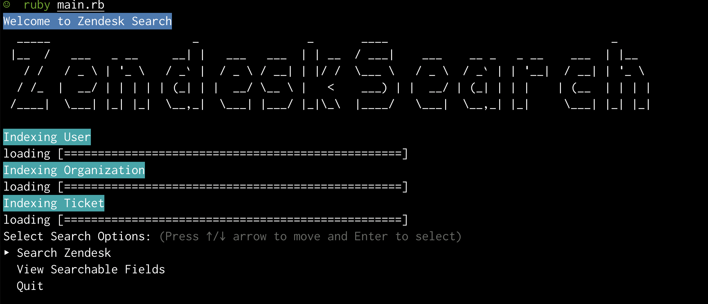
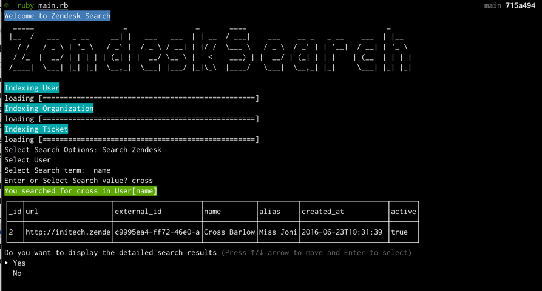
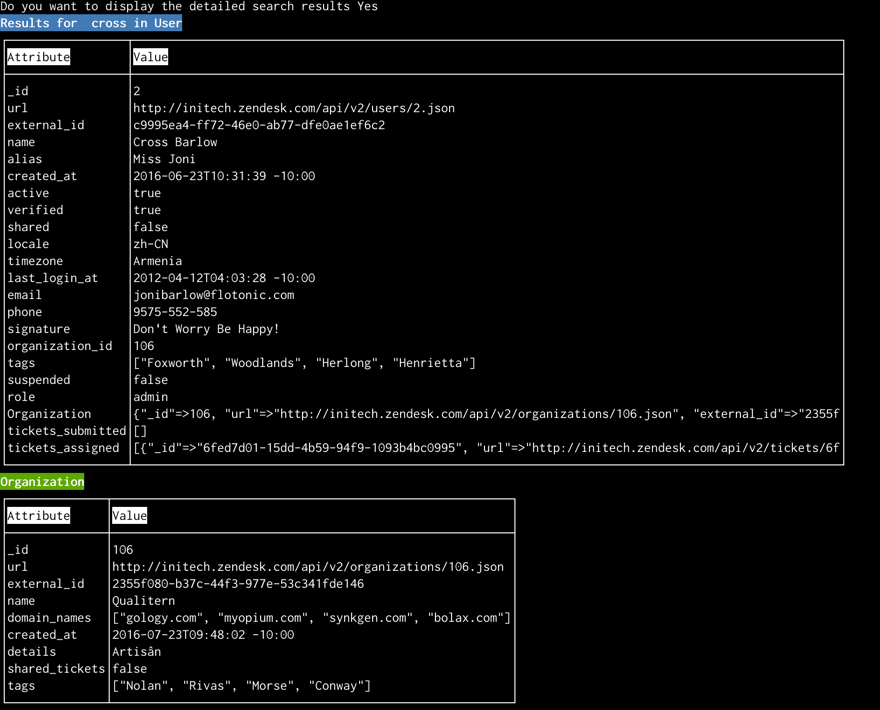
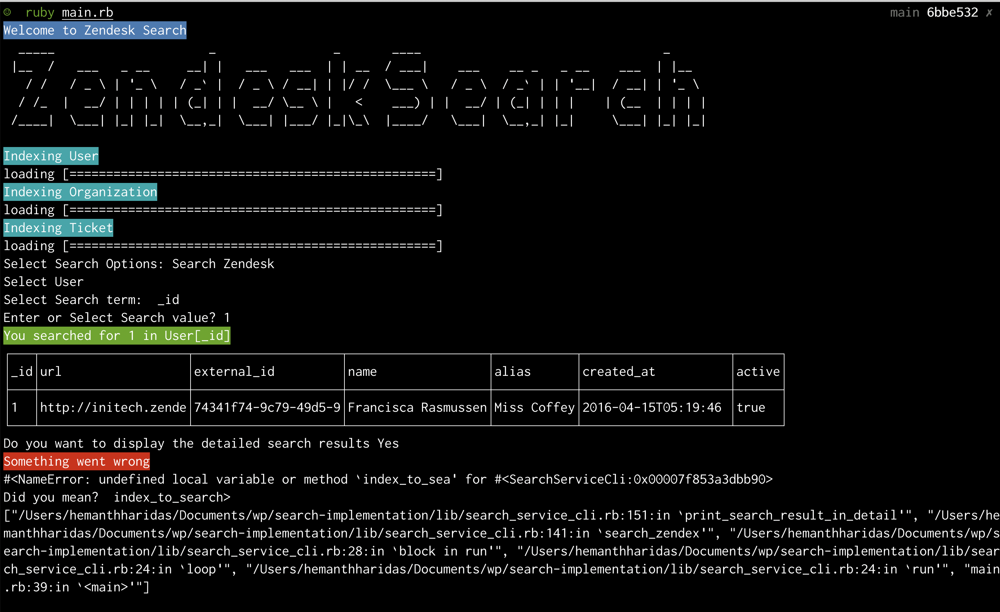
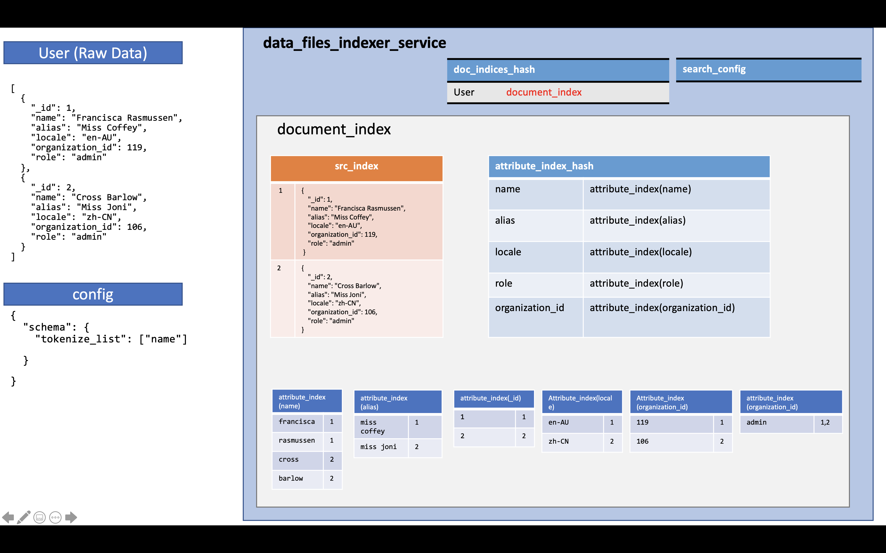

This is implementation of Basic Search from scratch. This is a CLI app. 

## Screenshots

### Initial Screen 



### Search an index, display summary of result



### Search an index, display detailed results 



### Exception Handling



## Summary 
This is a very simple implementation Search. Search is a vast topic and can get very complicated very fast.
This implementation works for json files and needs a config file to index and search. config file specifies the schema, to be used. 
Schema is useful to specify
- which fields should use text search and which ones exact match 
- Which fields have a reference one-to-one mapping
- Which fields have a reference one-to-many mapping

** What I proud of ? **
- I am proud of the design. Search will work for arbitrary json files. given a config.
- I am proud of README and comments inside the code, I can pick up and start running even after month or years due to this documentation & tests.
- We can easily extend the design to include ranking of search results.
- I am proud of adding 70 test cases and testing various corner cases. 
- You can search globally for all fields across all indices and it does a fairly good Job. 
- It scales pretty well , displaying search results, first displays summary results and then if you want displays detailed search results. 
- The UI also highlights the term you searched for in the search results. 

** What I am not proud of ? **
- The Search CLI code does not have tests, I really wanted to add tests but I ran out of time. 
- I wanted to add more corner cases tests fot DataFilesIndexerService, but couldn't bcos of time.
- I could not test for really large files. I don't know for what file size the app would break. 
- I could not implement ranking and word stemming, thoough its an easy extension due to the robust design.


### Running the specs
```shell
git clone git@github.com:hhemanth/search-implementation.git
cd search-implementation
bundle
rspec spec/ --format doc
```
### Running the App
use ruby 2.6.5

```shell
git clone git@github.com:hhemanth/search-implementation.git 
cd search-implementation
bundle 
ruby main.rb
```


### Indexing and Searching
#### Indexing
- DataFilesIndexerService is the entry point class. It accepts a options parameter which has the following format 
```javascript
options = {
    index_name: 'User',
    data_file: 'spec/fixtures/dataset1/users.json',
    config_file: 'spec/fixtures/dataset1/user_search_config.json',

}

```
- The options should have the mandatory fields index_name, data_file, config_file
    - index_name is self explainatory
    - data_file is a json file (Array of hashes), this is where the data that we wish to search resides.
    - config_file contains the schema used to index the data file, more on that soon
- To index files 
```ruby
  data_indexer_service = DataFilesIndexerService.new(options)
  data_indexer_service.index_data_files!
```
- The above command indexes the file provided in data_file "spec/fixtures/dataset1/users.json", using the shema provided in "spec/fixtures/dataset1/user_search_config.json"
#### Searching
Once the data file/s have been indexed, Search can be performed as follows using the data_indexer_service from above. 

- Searching for a single term in User index, name, attribute. Results will be an array of hashes. 
```ruby
result = data_files_indexer_service.search(index: 'User', attr: 'name', term: 'francisca')
```
- Search for "_id" in Ticket, index
```ruby
result = data_files_indexer_service.search(index: 'Ticket', attr: '_id', term: '436bf9b0-1147-4c0a-8439-6f79833bff5b')
```
- Search for multiple terms. It will resturn all tickets which has the term "hungery" ond/or "moroco" in subject attribute

```ruby
result = data_files_indexer_service.search(index: 'Ticket', attr: 'subject', term: 'Hungary morocco') 
```

- Search for an empty values in an attribute

```ruby
search_results = data_files_indexer_service.search(index: 'Ticket', attr: 'description', term: '')
search_results = data_files_indexer_service.search(index: 'Ticket', attr: 'description', term: nil) # same as above
```

- Search for a term in all attributes in an index. The below query will search all attributes in the index "User"

```ruby
search_results = data_files_indexer_service.search(index: 'User', term: 'francisca')
```

- Search for multiple terms in all attributes in an index. 

```ruby
search_results = data_files_indexer_service.search(index: 'Ticket', term: 'question Nicaragua')
```

- Search for empty values in all attributes in an index 

```ruby
search_results = data_files_indexer_service.search(index: 'Ticket', term: "") 
search_results = data_files_indexer_service.search(index: 'Ticket', term: nil)  # same as above
```

- *Search Global* : Search for a term in all Indices and in all Attributes 

```ruby
search_results = data_files_indexer_service.search_global(term: 'Nicaragua')
```
- *Search Global* : Search for multiple terms in all Indices and in all Attributes

```ruby
search_results = data_files_indexer_service.search_global(term: 'A Nuisance in Nicaragua')
```

- *Search Global* : Search for nil/empty values in all Indices and all attributes

```ruby
search_results = data_files_indexer_service.search_global(term: '')
search_results = data_files_indexer_service.search_global(term: nil) # same as above
```
### Validations
We have the following validations now

- config_file key in the config param pased has to be present
- data_file key in the config param pased has to be present
- config_file exists and is a valid json
- data_file exists and is a valid json - Array of Hashes
- config file has needed keys
- data file is an array of hashes

### About Design & Implementation

#### Search & Indexing
 


- The class **DataFilesIndexerService** is the entry class and also the integration service for **Search implementation**.
- As explained in the previous section, indexing and search can be performed using this class APIs.
- **DataFilesIndexerService** uses the following classes to build the index and search
    - **DocumentIndex** - DataFilesIndexerService maintains one DocumentIndex object per data file indexed
        - **SrcIndex** - **DocumentIndex** maintains one **SrcIndex** object. This is a hash, where the key is the id, and value is the whole record/ docuemnt
        - **AttributeIndex** - **DocumentIndex** maintains one **AttributeIndex** object for every attribute in the document. 
          This is a hash, where key is the search term, and value is an array of document ids where the term is found.
          the below diagram can do justice to it. **This is the actual search index to do the actual search.**
    - **IndexSearchConfig** -  DataFilesIndexerService maintains one **IndexSearchConfig** object to store the schema. 
      Which is derived from the options passed onto DataFilesIndexerService  
      
Sample data file which has 2 records (taken from organizations.json & most fields stripped). 

```[
     {
       "_id": 101,
       "name": "Enthaze",
       "details": "MegaCorp",
     },
     {
       "_id": 102,
       "name": "Nutralab",
       "details": "Non profit",
     }
     ]
 ```

Each data file has to accompanied by a config file. The config file should contain schema. Example config file for the above data file

```
{
 "schema": {
   "tokenize_list": [
     "name",
     "details",
   ]
 }
}
```

The term `tokenize_list` signifies which of the attributes in the data file, will be tokenized (split into words and each word indexed seperately). All attributes which are not specified part of `tokenize_list` are not tokenized or processed (except for downcasing), and are seachable only by exact match (example: id, external_id, url)


### How is data indexed?
The indexing of a data file produces the following 2 indices.

- SrcIndex
- An array of Attribute Indices, one for each attribute

The SrcIndex is as follows
       
```
"101" => {
          "_id": 101,
          "name": "Enthaze",
          "details": "MegaCorp",
        },
"102=> {
          "_id": 102,
          "name": "Nutralab",
          "details": "Non profit",
    }
```

The Attribute indices for few attributes look like this 

### name

```ruby
{
  "enthaze":  [1], 
  "nutralab": [2]
}

```


With the help of the above indices, we can search for any terms present in the document and return the results. If the search term is not present, then we return an empty response.

#### Other classes

- **AnnotateSearchResults** is used to add one-to-one & one-to-many relation entities to the search results. 
  For example If the search result contains a User object, which has organization_id field, then **AnnotateSearchResults** adds 
  a **Organization** field which will contain the **organization** object corresponding to organization_id
- **IndexSearchConfig** contains the schema to be used while indexing data files. For example the schema for **User** index is as follows. 
    - **tokenize_list**, tells that the fields *name, signature, tags, alias* are text fields and their contents be broken down into token before indexing
    - **one_to_one_reference_config** - responsible to handlin one-on-one relations, for example adding an **organization** if **organization_id** 
      exists in the **User** search sesults
    - **one_to_many_reference_config** - responsible to handlin one-to-many relations, for example adding field **tickets_submitted** (which will be
      an array of tickets (Hash)) using the submitter_id (which is a user_id) in Tickets data_file. 
      Like wise adding field field **tickets_assigned** (which will be an array of tickets (Hash)) using the assignee_id (which is a user_id) 
      in Tickets data_file.
- **CompositeTokenizer, ArrayTokenizer, TextTokenizer** are used convert strings, Arrays to tokens. 
  Will be further useful to add text stemming and other advanced tokenizations.
- **ErrorMsg** stores error messages used.

```ruby
{
  "schema": {
    "tokenize_list": [
      "name",
      "signature",
      "tags",
      "alias"
    ],
    "one_to_one_reference_config": [
      {
        "reference_id":  "organization_id",
        "reference_entity": "Organization"
      }
    ],
    "one_to_many_reference_config": [
      {
        "reference_id":  "submitter_id",
        "reference_entity": "Ticket",
        "result_term": "tickets_submitted"
      },
      {
        "reference_id":  "assignee_id",
        "reference_entity": "Ticket",
        "result_term": "tickets_assigned"
      }
    ]
  }
}
```